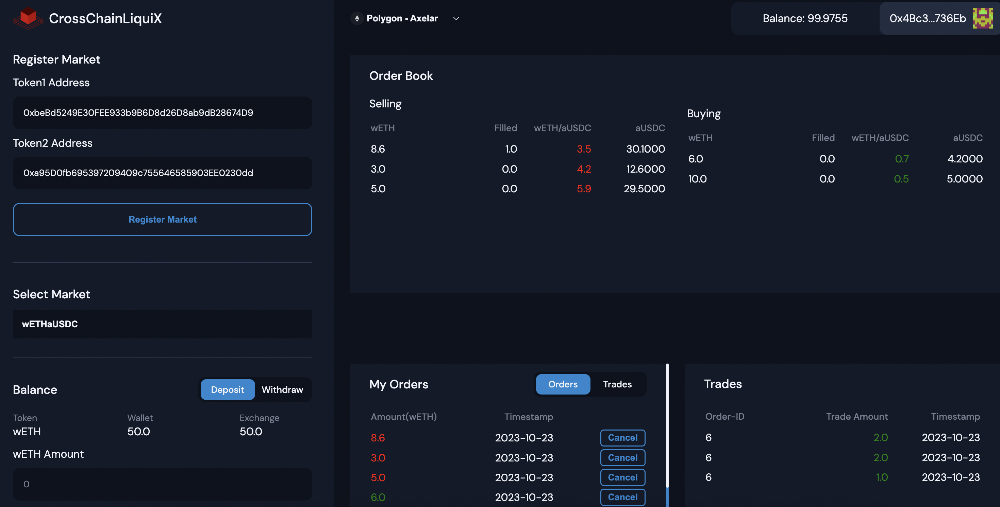
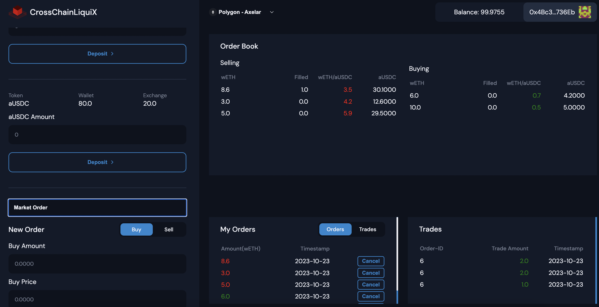

# CrossChainLiquiX - CrossChain Decentralized Exchange

## Overview
CrossChain DEX is a decentralized exchange platform designed to provide a user-friendly trading experience across multiple EVM-compatible blockchains. 

## Features
- Unifies Liquidity Across All EVM Chains: No matter which EVM chain your assets originate from, they can be brought together and traded seamlessly.
- No Need to Switch for Trading: Stay on a single chain and trade without the hassles of switching between different chains.
- Automatic Bridging with Axelar: Assets are automatically transferred and made available on the default chain using the Axelar protocol.

## Pending or Yet to be Worked On:
- Integration with Parachains: In the future, the exchange will not just interact with EVM chains but will also interface with all the parachains deployed on Polkadot. This aims to establish Moonbeam as the central hub for all cross-chain activity.
- Unified Liquidity Aggregation: The ultimate goal is to aggregate the liquidity from all the EVM chains and all the parachains. This will make it possible to unify the entire liquidity pool and facilitate trading in one central location.
- Current Status: As of now, integration is solid with EVM chains. However, the integration of parachains is still pending and will be part of the next phase of development.

## Tech Stack
- Smart Contracts: Solidity
- Frontend: ReactJS
- Dependencies: Hardhat, Ethers.js, OpenZeppelin, Axelar Network, Redux, and more

## Problems Solved
- Limits users access to a wide range of cryptocurrencies
- Eliminates the need to use multiple exchanges
- Reduces inefficiencies such as slippage, single chain dependency, and price discrepancies

## Screenshots




## Presentation
For a more detailed overview, please refer to this [presentation](https://www.canva.com/design/DAFyIXsY1e0/Bom5_Za7dhqwFoZv26saIA/view?utm_content=DAFyIXsY1e0&utm_campaign=designshare&utm_medium=link&utm_source=editor).

## Installation and Setup
### Install Dependencies
```bash
npm install

# Compile the smart contracts using Hardhat
npx hardhat compile

# Start the development server
npm start

# Local Testing
- Install and run Axelar network in your local environment(https://github.com/axelarnetwork/axelar-local-dev).
- Deploy bridge.sol and exchange.sol contracts in the Axelar networks of your choice.
- Make sure to have supported tokens in your Axelar protocol.
- Also, make sure to update bridge and exchange contract addresses in the config.json file

# Configuration
- Make sure to update config.json with proper network and contract addresses. 
For example:
{
    "2504": {
        "exchange": {
            "address": "0xe111521B82D932da64F0b9605F785Db947B2Fbdc"
        },
        "bridge": {
            "address": "0x569dc8705da85B297e3397B80551eD2e5aEa96Ce"
        }
    },
    "2500": {
        "exchange": {
            "address": "0xe111521B82D932da64F0b9605F785Db947B2Fbdc"
        },
        "bridge": {
            "address": "0x569dc8705da85B297e3397B80551eD2e5aEa96Ce"
        },
        "tokens": {
            "wETH": "0xbeBd5249E30FEE933b9B6D8d26D8ab9dB28674D9",
            "aUSDC": "0xa95D0fb695397209409c755646585903EE0230dd"
        }
    }
}
```

Note: In the example, 2500 refers to Moonbeam and 2504 refers to the Polygon network IDs. 2500 is set as the default chain, making Moonbeam act as an execution layer.